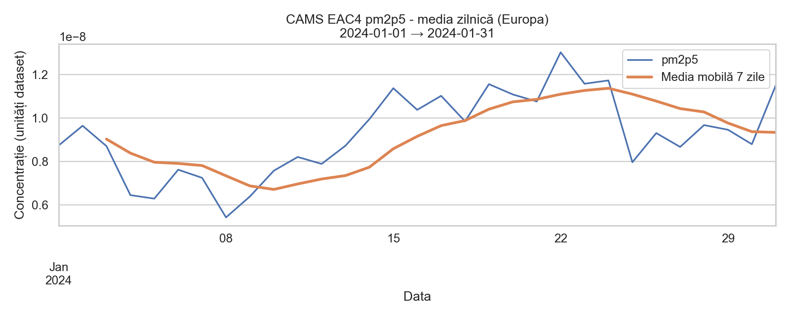
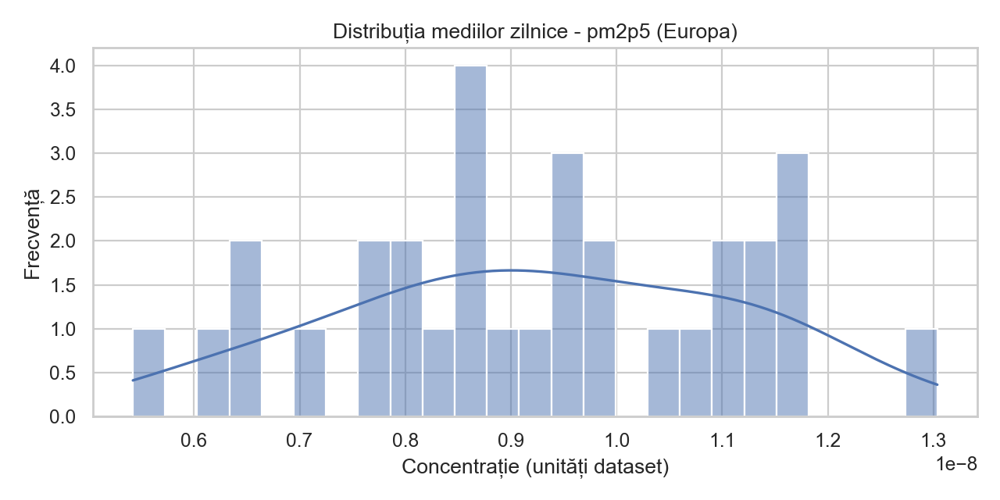
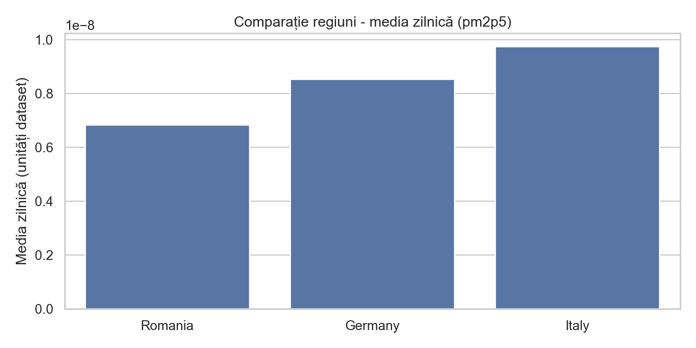

# Lucrare de laborator Nr. 3 — Vizualizarea Datelor

## Tema
Analiza și vizualizarea datelor atmosferice folosind Serviciul de Monitorizare a Atmosferei Copernicus (CAMS), setul de date **CAMS Global Reanalysis (EAC4)**.

## Date utilizate
- Sursă: Copernicus Climate Data Store (CDS) API, dataset `cams-global-reanalysis-eac4`
- Poluant/variabilă: `particulate_matter_2.5um` (PM2.5, conform denumirii din dataset)
- Perioadă (exemplu): `2024-01-01` → `2024-01-31`
- Arie (exemplu, Europa): N=60, W=-10, S=35, E=30

Notă: dacă nu există configurare CDS (`.cdsapirc`), scriptul poate rula în mod demo cu `CAMS_DEMO=1` (date sintetice, doar pentru a genera vizualizările end-to-end).

## Preprocesare
- Datele sunt descărcate în format NetCDF și încărcate cu `xarray`.
- Coordonatele sunt normalizate la `lat`/`lon`.
- Se calculează media spațială (pe grilă) și apoi media zilnică (resampling la `D`).
- Pentru comparație regională se calculează mediile zilnice în 3 regiuni (România, Germania, Italia), pe sub-arii (bounding boxes).

## Analiză (statistici descriptive)
Sunt calculate: media, mediana, deviația standard, minim, maxim și numărul de observații (zile).

Fișiere rezultate:
- `outputs/stats_europe.csv`
- `outputs/stats_regions.csv`

## Vizualizări
1) Serie temporală (medie zilnică + medie mobilă 7 zile):
- `outputs/timeseries_europe.png`

2) Histogramă a mediilor zilnice:
- `outputs/hist_europe.png`

3) Comparație regiuni (bar chart al mediei zilnice):
- `outputs/regions_bar.png`

4) Hartă termică (heatmap) a valorilor medii zilnice pe grilă (Folium, HTML):
- `outputs/heatmap_YYYY-MM-DD.html` (implicit data de start)

## Interpretarea rezultatelor (model de concluzii)
- Seria temporală evidențiază variații zilnice și eventuale episoade cu valori ridicate (vârfuri), iar media mobilă sugerează tendința pe termen scurt.
- Distribuția (histograma) arată dacă valorile sunt concentrate într-un interval îngust sau există cozi (valori extreme).
- Comparația între regiuni poate indica diferențe sistematice (de ex. influența condițiilor meteorologice, a transportului pe distanțe lungi, sezonalitate).
- Harta termică evidențiază pattern-uri spațiale (zone cu concentrații mai ridicate), utile pentru monitorizare și comunicare publică.

## Utilitate (politici / conștientizare)
- Identificarea episoadelor de poluare poate susține măsuri punctuale (alertare, restricții temporare).
- Diferențele regionale pot ghida intervenții țintite și evaluarea eficienței politicilor.
- Vizualizările ușurează comunicarea către public (în special hărțile și seriile temporale).
